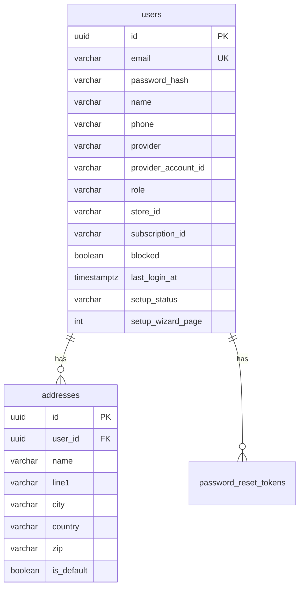

# auth-service

Identity, users, addresses, and password-reset tokens. Intended JWT issuer for the platform. Port **3001**, schema **`auth_svc`**.

Platform design: [System design](https://github.com/digi-carts/doc/blob/main/architecture/system-design.md)

## Domain

Multi-tenant users with roles `superadmin`, `merchant`, and `user`. Merchants are linked via `store_id` and `subscription_id`. Setup wizard progress lives on the user (`setup_status`, `setup_wizard_page`). Social login fields (`provider`, `provider_account_id`) exist on the entity; password hashes are stored for email/password.

**Current code** exposes CRUD on users, addresses, and reset tokens. Login / register / refresh controllers are **not present yet**; the gateway still treats `/api/auth/login|register|refresh` as public. Frontends call `${NEXT_PUBLIC_API_URL}/auth/refresh`.

## Tech stack

Java 21, Spring Boot 3.3.0, Spring Web, Data JPA, Validation, Spring Security, Liquibase, PostgreSQL, JJWT 0.12.6, Cloud SQL socket factory.

## Data model



Migrations: `src/main/resources/db/changelog/migrations/001-initial-schema.xml`. Hibernate `ddl-auto: validate`.

## HTTP API (service-native)

Controllers trust optional `X-User-Id` / `X-User-Role` headers from the gateway.

### Users — `/users`

| Method | Path | Notes |
|--------|------|--------|
| GET | `/users` | Optional `?storeId=` filters by store |
| GET | `/users/{id}` | |
| GET | `/users/email/{email}` | |
| POST | `/users` | `CreateUserRequest` |
| PATCH | `/users/{id}` | `UpdateUserRequest` |
| DELETE | `/users/{id}` | 204 |

### Addresses — `/addresses`

| Method | Path |
|--------|------|
| GET | `/addresses` |
| GET | `/addresses/user/{userId}` |
| GET | `/addresses/{id}` |
| POST | `/addresses` |
| PATCH | `/addresses/{id}` |
| DELETE | `/addresses/{id}` |

### Password reset — `/password-reset-tokens`

| Method | Path |
|--------|------|
| GET | `/password-reset-tokens/{id}` |
| GET | `/password-reset-tokens/token/{token}` |
| POST | `/password-reset-tokens` |
| DELETE | `/password-reset-tokens/{id}` |
| DELETE | `/password-reset-tokens/email/{email}` |

### Health

`GET /health`

Gateway expected prefixes: `/api/auth/**`, `/api/address/**`.

## Configuration

| Variable | Required | Default |
|----------|----------|---------|
| `DATABASE_URL` | yes | JDBC URL with `currentSchema=auth_svc` |
| `PORT` | no | `3001` |
| `JWT_SECRET` | intended | Same as api-gateway |

## Local run

```bash
export DATABASE_URL="jdbc:postgresql://localhost:5432/digicarts?currentSchema=auth_svc"
export JWT_SECRET="local-dev-secret-at-least-32-chars!!"
mvn spring-boot:run
```

## CI/CD

Push `stage` → Cloud Run `digi-cart-auth-service-dev`. Push `main` → release + `digi-cart-auth-service`.

## Related

- [api-gateway](https://github.com/digi-carts/api-gateway/blob/stage/doc/README.md)
- [platform-service](https://github.com/digi-carts/platform-service/blob/stage/doc/README.md) (subscriptions, admin users)
- [merchant-ui](https://github.com/digi-carts/merchant-ui/blob/stage/doc/README.md)

## REST API reference

See [api.md](api.md) for every HTTP endpoint generated from Spring controllers.
